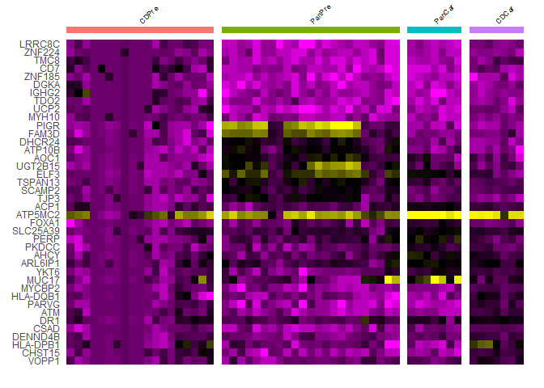

Description Caaban Project
================

Hi Katy,

Long time since you heard from us, really sorry for that. Here I’m
sending you a few more pictures and some text trying to touch on the
issues you raised in your latest emails. In particular, at the end of
this file you will find some Method Section description of what we did,
you could include in your paper.

#### Here is some brief data description

    ## An object of class Seurat 
    ## 37354 features across 56 samples within 2 assays 
    ## Active assay: SCT (18677 features, 3000 variable features)
    ##  1 other assay present: GeoMx
    ##  2 dimensional reductions calculated: pca, umap

Data include expression counts for 18677 features (genes) on 56 ROIs.

Here is the distribution of ROIs per patient per disease/cell category.
The first four patients are from the first set (denoted “Fr” in the
pictures below), next three patients, 5,6,7 being from the second set
(“Sc”), as mentioned in your latest file describing the DCC samples from
the second set.

    ##   SET Patient CDCar PanCar CDPre PanPre
    ## 1 Fr  1       3     3      0     0     
    ## 3 Fr  3       4     4      0     0     
    ## 2 Fr  2       0     0      3     3     
    ## 4 Fr  4       0     0      2     2     
    ## 5 Sc  5       0     0      10    6     
    ## 6 Sc  6       0     0      4     6     
    ## 7 Sc  7       0     0      0     6

### UMAPs

I had a second look at the way the data from the two sets were
integrated and come up with some updated version of the UMAP pictures,
hopefully mixing the ROIs from the two sets better this time.  
Here is the new UMAP picture showing the two sets in different colours,
I think the mixing seems a bit better than in the last UMAP I sent you.

<!-- -->

And here is the distribution and positioning on the UMAP of each Patient
Rois

<!-- -->

One encouraging thing is the UMAP seems to sepparate pretty well the
four segment types annotated in the initial DSS file description.

<!-- -->

As it is customary for scRNA data I tried clustering the ROIs. The
software suggested three clusters as below:

<!-- -->

Here is how the clusters overlap the initial segment types:

<!-- -->

And here is the number of ROIs per cluster per segment type

    ##         
    ##           1  2  3
    ##   CDCar   5  2  0
    ##   CDPre   4 15  0
    ##   PanCar  6  1  0
    ##   PanPre  0  6 17

### Deconvolution with cellDex

I also run again the cell type deconvoluton, this time with a diffrent
package (cellDex), and a very comprehensive reference set Human primary
cell atlas (HPCA). The cell types assigned to each ROI probably differ
substantially from what I sent you before (again I used a diffrent
package and a diffrence reference), but it seems they provide a good
separation of the epitelial versus immune cell.

Here is a heat map listing the cell type assigned per ROI. Each column
in the heat map is a ROI, each row a cell type. The highest color
intensity decides ROI assigned cell type as marked by the segments on
the top bar (note the yellow segment, epithelial cell, make a large
portion of the assignments) .

<!-- -->

Here is the distribution of assigned cell types per segment type and
their position on the UMAP (only top 6 most abundant cell types are
included on the picture)

<!-- -->

Here are the number of ROIs assigned to each cell type per segment type

    ##                    
    ##                     CDCar CDPre PanCar PanPre
    ##   Astrocyte             0     1      0      0
    ##   B_cell                2     2      0      0
    ##   DC                    0     0      1      1
    ##   Epithelial_cells      0     0      5     21
    ##   Erythroblast          0     1      0      0
    ##   Gametocytes           0     1      0      0
    ##   iPS_cells             0     0      1      0
    ##   Macrophage            2     3      0      0
    ##   Monocyte              3     0      0      1
    ##   MSC                   0     1      0      0
    ##   Myelocyte             0     1      0      0
    ##   Neutrophils           0     3      0      0
    ##   Platelets             0     2      0      0
    ##   T_cells               0     3      0      0
    ##   Tissue_stem_cells     0     1      0      0

And here is the ROIs distribution per assigned cell type, per each of
the 3 clusters the software suggested

    ##                    
    ##                      1  2  3
    ##   Astrocyte          0  1  0
    ##   B_cell             4  0  0
    ##   DC                 0  2  0
    ##   Epithelial_cells   5  4 17
    ##   Erythroblast       0  1  0
    ##   Gametocytes        0  1  0
    ##   iPS_cells          1  0  0
    ##   Macrophage         1  4  0
    ##   Monocyte           2  2  0
    ##   MSC                0  1  0
    ##   Myelocyte          0  1  0
    ##   Neutrophils        0  3  0
    ##   Platelets          0  2  0
    ##   T_cells            2  1  0
    ##   Tissue_stem_cells  0  1  0

### Six groups clustering

Looking at all the pictures and tables above I decided to combine the
segment type classification with the clustering into a new, finer
clustering, including 6 groups, basically along the segment types, with
each CDPre and PanPre split in two.  
Here is the mapping of the 6 clusters onto UMAP representation:

<!-- -->

Here is the number of ROIs in each of the 6 clusters:

    ## 
    ##    CDCar    CDPre  CDPre_1   PanCar   PanPre PanPre_1 
    ##        7       15        4        7       17        6

Here is a depiction of the cell types assigned by deconvolution inside
the six clusters. The picture and the table below it should help in
giving a meaning to each cluster.

<!-- -->

    ##                    
    ##                     CDCar CDPre CDPre_1 PanCar PanPre PanPre_1
    ##   Astrocyte             0     1       0      0      0        0
    ##   B_cell                2     0       2      0      0        0
    ##   DC                    0     0       0      1      0        1
    ##   Epithelial_cells      0     0       0      5     17        4
    ##   Erythroblast          0     1       0      0      0        0
    ##   Gametocytes           0     1       0      0      0        0
    ##   iPS_cells             0     0       0      1      0        0
    ##   Macrophage            2     3       0      0      0        0
    ##   Monocyte              3     0       0      0      0        1
    ##   MSC                   0     1       0      0      0        0
    ##   Myelocyte             0     1       0      0      0        0
    ##   Neutrophils           0     3       0      0      0        0
    ##   Platelets             0     2       0      0      0        0
    ##   T_cells               0     1       2      0      0        0
    ##   Tissue_stem_cells     0     1       0      0      0        0

## Caracterize the Clusters

Also of some help in clusters characterization should be the lists
below, of top 6 genes per each cluster (I picked top 6 to fit in the
heatmap below, showing for each gene the expression profile across all
ROIs and the cluster expression profile separation.)  
Note that, for each cluster, the top genes are genes highly expressed in
that cluster compared to all other 5 cluster (Meaning if there is some
gene missing that you think it should be among these 6 on top, it might
be because that gene is also high in one of the other five clusters)

    ##          [,1]                                           
    ## CDPre_1  "TRAC, JAK3, CORO1A, CXCL13, LTB, LDHB"        
    ## CDPre    "CSF3, SLCO1B7, PYGL, MCOLN2, F9, CATSPER3"    
    ## PanPre   "LLGL2, FXYD3, SLC44A4, CLDN3, UQCRC1, PIGR"   
    ## PanPre_1 "TAS2R45, TSNAX, MRGPRX1, GMPR, ELAVL4, KCNAB1"
    ## PanCar   "ACP1, ATP5MC2, FOXA1, SLC25A39, PERP, PKDCC"  
    ## CDCar    "MYCBP2, HLA-DQB1, PARVG, ATM, DR1, CSAD"

<!-- -->

Similarly here are the top 10 genes and the heatmap with their
expression profiles for the initial four segment types. Again these are
genes differential expressed between one group and all the other three,
and high in the reference group. These top gene information is supposed
to complement what I sent you before, not replace it. The genes
differential expressed between pairs of groups are those I already sent,
and also uploaded for interactive analysis in Ingenuity.

    ##        [,1]                                                                       
    ## CDPre  "LRRC8C, ZNF224, TMC8, CD7, ZNF185, DGKA, IGHG2, TDO2, UCP2, MYH10"        
    ## PanPre "PIGR, FAM3D, DHCR24, ATP10B, AOC1, UGT2B15, ELF3, TSPAN13, SCAMP2, TJP3"  
    ## PanCar "ACP1, ATP5MC2, FOXA1, SLC25A39, PERP, PKDCC, AHCY, ARL6IP1, YKT6, MUC17"  
    ## CDCar  "MYCBP2, HLA-DQB1, PARVG, ATM, DR1, CSAD, DENND4B, HLA-DPB1, CHST15, VOPP1"

<!-- -->

Most scRNA papers try to identify some small group of cells that behaves
unexpectedly and try to characterize it (this was the main reason for me
to split the PanPre and CDPre in two). As an attempt to characterize the
two small subgroups below are heat maps of the top differential
expressed genes between PanPre_1 and the rest of PanPre, respectivele
CDPre_1 and the rest of CDPre. Note this time the selected genes might
be either over expressed or under expressed in the reference group
(unlike as above were it had to be overexpressed)  
If you find any vale in these lists of markers I could upload them to
Ingenuity for interactive analysis and altered pathway identification,
along with the others.

#### PanPre_1 markers

    ## [1] "ZNF311, NFE2, UBQLN4, CCIN, PNOC, KDELR1, RAB2A, COX7C, TAGLN2, YWHAE, C19orf33, DDX39B, CST3, H2AC11, LLGL2, EIF3K, CTNND1, LGALS3, COX6C, ELOB, ARF1, VAMP8, HLA-E, HNRNPU, XBP1"

<!-- -->

#### CDPre_1 markers

    ## [1] "SLC16A5, PRSS58, RAB6C, MOSPD2, ERV3-1, FER1L6, FAM222B, BTBD18, STPG3, PYGL, RELB, DLEC1, OTUD1, SLC38A5, GH1, MATN3, RBM24, CCDC89, OR10G6, CYP2B6, OR2F2, CTRC, CFAP161, PGLYRP4, EPPIN"

<!-- -->

### Method Section

And here is a brief description of the analysis tools we used, you can
include in your paper.

**ScRNA-seq data preprocessing, quantification and analysis**  
GeoMX digital spatial profiling paraffin embedded tissues from 5 preterm
NEC and 2 cardiac NEC patients were processed and analyzed at OMRF
NanoString GeoMx service Imaging core using a combination of
fluorescently labeled antibodies and the GeoMx Whole Transcriptome Atlas
(WTA), targeting over 18,000 human protein coding genes. Roughly equal
number of immune-rich (CD45) and epithelial-rich (Pan-CK) regions of
interests (ROIs) were selected per patient, summing up to 7 ROIs per
condition in cardiac samples and about 21 ROIs per condition in preterm
samples. After selecting regions of interest (ROIs) on the GeoMx DSP,
the DSP barcodes were UV cleaved and collected. During library
preparation, the DSP barcodes were tagged with their ROI location then
sequenced on an Illumina sequencer. Sequenced oligonucleotides were
processed then imported back into the GeoMx DSP platform for integration
with the slide images and ROI selections for spatially-resolved RNA
expression. Using the Nanostring GeoMx Digital Spatial Profiler (DSP)
sequencing technology whole human transcriptome abundance for each
region of interest (ROI) was quantified. The DSS files with raw count
data were imported into R, QC filtered and normalized using GeomxTools
package from Bioconductor. RNA probe counts used in the analyses were
selected following a sequencing QC according to Nanostring protocols,
where counts from each area of interest are analyzed and under-sequenced
samples are dropped (field of view percentage of 75% and Binding density
from 0.1 to 2.25), and a probe QC, where mRNAs are targeted by multiple
probes and outlier probes are dropped from downstream data analysis
(positive spike-in normalization factor between 0.3 and 3). Then RNA
counts were normalized using a signal-based normalization, in which
individual counts are normalized against the 75th percentile of signal
from their own area of interest. Normalized data were then coerced into
a Seurat object and standard subsequent analyses was performed using the
integrated pipeline of Seurat R package. After selection of highly
variable features the integrated data over all 7 samples were subject to
PCA and nonlinear dimensionality reduction with UMAP/sSNE. 3 clusters of
ROIs were generated using the K-nearest neighbor (KNN) approach with SLM
modularity optimization implemented by FindClusters function (resolution
= 0.015) of the Seurat package. UMAP 2d representation was used to
visualize the result of clustering. Differential expression analysis
between ROI conditions and cancer types, and identification of conserved
cell type markers within each cluster, was performed with Seurat
FindMarkers function and expression profiles of the selected features
were visualized with DoHeatmap function. Adjusted p\<0.05 and
\|log2FC\|\>0.25 was used to defined significant DEGs.  
Functional analysis, identifying sets of genes sharing the same
functionality (GO, KEGG pathways), overrepresented among the lists of
differentially expressed features, was performed with specialized
packages from Bioconductor. Ingenuity Pathway Analysis (IPA, QIAGEN,
Redwood City CA) was used to identify and explore significantly altered
pathways, functional sets and gene networks interactively.  
Mixed cell deconvolution on each ROI was perform with celldex package
functionality. Using the gene expression data, abundance of each cell
type within each observation was estimated and the dominant category was
assigned as ROI cell type. Relative percentage distribution and
enrichment of cell types across clusters, disease type and Pan-CK/CD45
condition was studied and visualized using Correspondence Analysis
tools.
